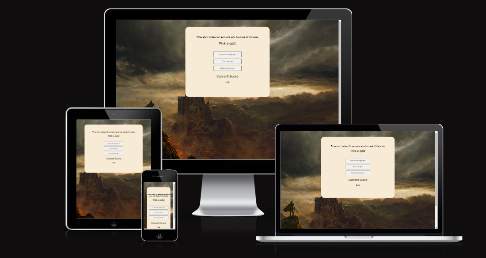
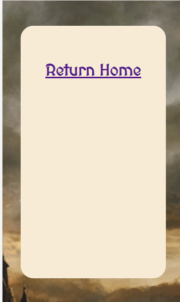
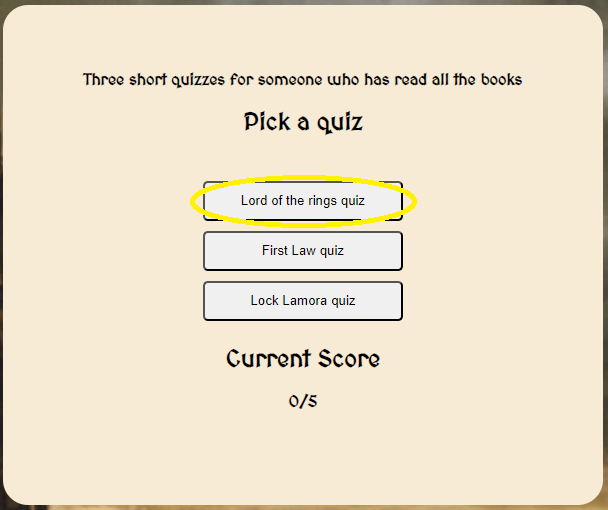
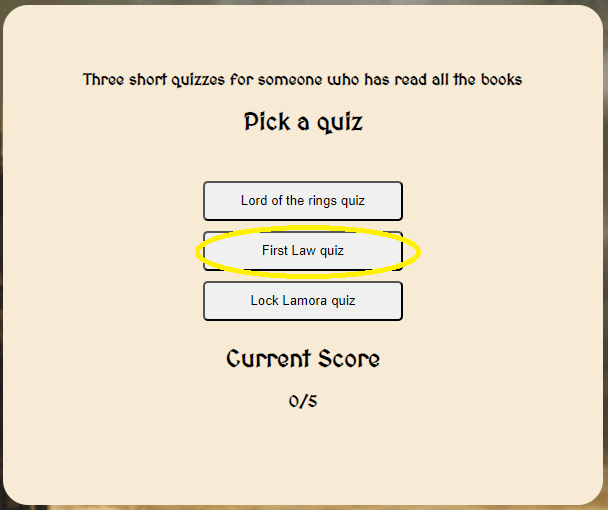
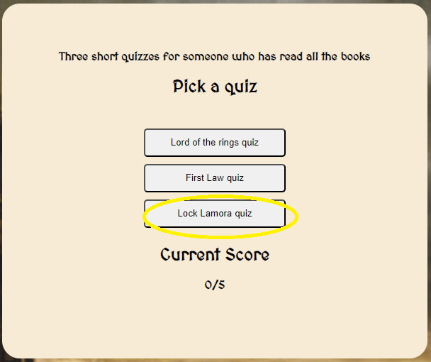
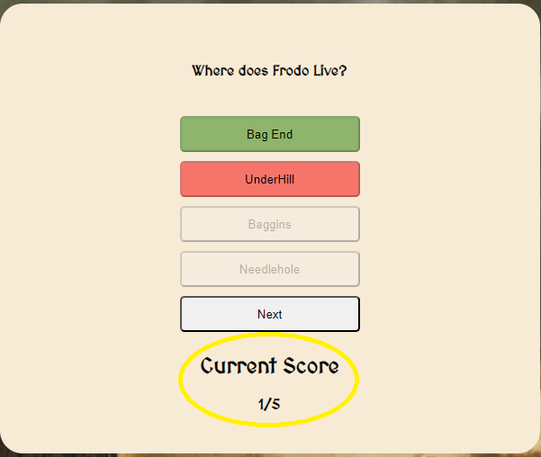
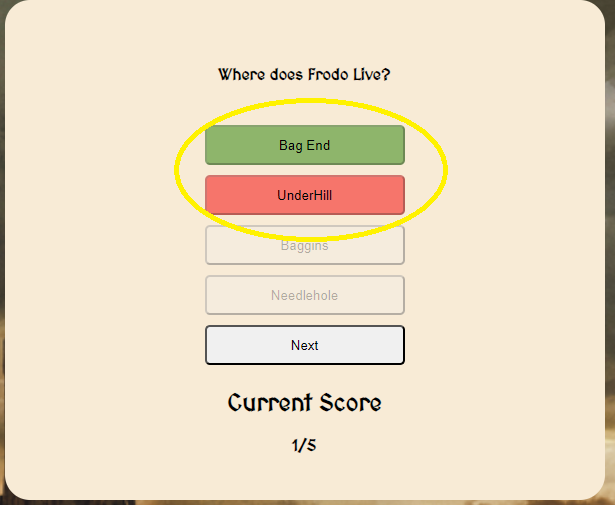
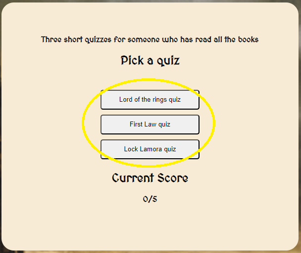

# Fantasy book quiz

Developer : Mattias Lundkvist

## project overview

## Subject 
To make a small webpage wit a few short quizzes

## Table of contents

1. [Project Goal](#project-goal)
2. [User Experience](#user-experience)
    1. [User Requirements and Expectations](#user-requirements-and-expectations)
    2. [User Stories](#user-stories)
3. [Design](#design)
    1. [Colours](#colours)
    2. [Fonts](#fonts)
    3. [Wireframes](#wireframes)
4. [Technologies Used](#technologies-used)
    1. [Languages](#languages)
    2. [Tools](#tools)
5. [Features](#features)
6. [Testing](#testing)
    1. [HTML Validation](#html-validation)
    2. [CSS Validation](#css-validation)
    3. [Accessibility](#accessibility-testing)
    4. [Performance](#performance)
    5. [Device testing](#performing-tests-on-various-devices)
    6. [Browser compatibility](#browser-compatibility)
    7. [User stories testing](#user-stories-testing)
7. [Bugs](#bugs)    
8. [Deployment](#deployment)
9. [Credits](#credits)
10. [Acknowledgements](#acknowledgements)

## Project goal

The goal of this website is to attract individuals , ages six (6) and above, of different genders, with or without Muay Thai experience, and who wants to try a unique and fun way of keeping fit. The aim is to design a fully functional website that is user-friendly and can be easily accessed on all devices.

## User Experience

- Ages 6 and up.
- Anyone who is interested to learn Muay Thai and get fit.
- All levels and abilities welcome.

### User requirements and expectations

- An easily navigable website.
- Links works as expected.
- Good presentation and a visually appealing design regardless of screen size.
- An easy way to contact the gym.
- Simple content that the user can skim read.

### User Stories

### First-Time Users

1. As a first-time user, I would like to know straight away which city the gym is located.

2. As a first-time user, I would like to know a little history and background information about Muay Thai.

3. As a first-time user, I would like to easily contact the gym for more information.

4. As a first-time user, I would like to know more about the trainers.

5. As a first-time user, I would like to be able to easily find the contact information such as phone and email and the complete address of the gym.

6. As a first-time user, I would like to see the membership prices and weekly schedules.

7. As a first-time user, I would like to be able to locate the gym easily.

### Returning Users

8. As a returning user, I would like to be able to contact the gym easily if I need more information.

9. As a returning user, I would like to be able to see the weekly schedules and the different classes offered.

10. As a returning user, I would like to find the gym on different social media sites.

### Site Owner

11. As a site owner, I want my users to be able to locate the gym easily.

12. As a site owner, I want my users to be able to find the gym’s contact details and complete address easily.

13. As a site owner, I would like my users to be able to contact us for more information.

14. As a site owner, I would like the membership prices, schedules, and different training classes to be readily available for our users.

15. As a site owner, I would like my users to know who our trainers are.

## Features

#### Navigation bar

The site will provide easy access and user friendly tabs which will instantly open and will direct the user to the Homepage, the schedules, and the contact details with just one click. These will be found on the header of all pages to access the different pages without the user having to click back.

#### The Landing Page

The main page includes a photograph of a Muay Thai fighter giving his respects as part of the pre-fight ritual. It also includes a text overlay of the gym location and the three main values which the gym aims to emulate to its members.

#### Short description of Muay Thai

This section gives the user a brief history and introduction about what the sport is all about and all this information is provided as a text overlay. It includes a photograph of the traditional Muay Thai techniques.
Also included is a link to the schedules.

#### The Trainers

The user can find the name and photo of the trainers with brief introductions about their Muay Thai experiences.

#### Map

The user is provided with an interactive map which points out the exact location of the gym. This is very helpful especially for first time users who are not familiar with the gym location.

#### Footer

The user is provided with the different relevant social media platforms, which when clicked, will open to a new tab. This will make the navigation easier for the user.

Also included is th contact information such as the phone number, email address, and the physical address.

#### Schedule 

The user is provided a table showing the various training times and days of the week and for which levels or classes.

#### Classes

This shows the user the different types of Muay Thai classes provided in the gym. Under each class is a short description that gives the user an idea what to expect and who are included in those classes.

#### Membership prices

Here, the user can see some of the different membership prices provided as well as a link to the contact details for more information regarding price and payment options.

#### Contact Us

This provides an easy way of getting in touch with the gym by filling out the online form with the relevant information needed and clicking "Submit" to send the message.

#### Additional Photo section 

Just below the "Send us a message" part is an additional photograph showing some of the trainers in their victory pose.

#### 404 Page

Added a custom 404 page for fun.

## Design

### Layout

I specifically chose this simple yet slick lay out because it matches the theme of the gym, simple, very straightforward and all about Muay Thai.

### Colours

The name itself, Fairfight Muay Thai gym, focuses only on Muay Thai so all the colours I used are those that are heavily connected to the sport.

I went with a black and white background because it symbolizes fairness and equality in sports and the new official fights have introduced black and white corners in the ring instead of the red and blue corners. 

This colour combination is also very easy on the eyes.

Red is a very prominent and fierce colour that is very commonly used in Muay Thai. On black background, it stands out more which is perfect for the title.

Blue is another dominant colour used in Muay Thai and it is also very subtle and soft on the eyes. 

I also added the Golden Rod colour which works well with the dark background.

Additional colours used are for the social media icons in the site.

The specific colours I used on the site are as follows:

1.	Black: black
2.	White: #FFFFF0
3.	Red: #c50822
4.	Blue: #1475e4
5.	Golden Rod: goldenrod
6.  Facebook blue icon: #3b5998
7.	Instagram purple icon: #962fbf
8.	Twitter blue icon: #1475e4

All colours were taken from style css color picker and I tested them several times before settling for the right shade.

### Fonts

Google fonts were used to import the 'Martian Mono and Nunito Sans' font used throughout the website:

[Mogra](https://fonts.google.com/specimen/Mogra?query=mog&preview.text=mogra&preview.text_type=custom)

[Lato](https://fonts.google.com/specimen/Lato?query=lato)

Mogra is used for the headers.
Lato is used for all other text since it makes it easier to read

### Wireframes

Home

Schedule

Contact

## Technologies used :

### Languages

- HTML
- CSS

### Tools

- Github
- Gitpod
- Tiny PNG
- Balsamiq
- Google Fonts
- Font awesome
- W3C Validator
- Jigsaw CSS Validator
- WAVE Web Accessibility Evaluation Tool

## Testing

The WC3C Validation Service was used to test and validate the HTML of the website.
Jigsaw CSS Validator is used for the CSS.
WAVE Web Accessibility Evaluation Tool is used to test accesibility function.

## HTML Validation

All tests returned no errors

index : [Link](https://validator.w3.org/nu/?doc=https%3A%2F%2Fmindfalls.github.io%2Ffairfight-muay-thai%2F)

Schedule : [Link](https://validator.w3.org/nu/?doc=https%3A%2F%2Fmindfalls.github.io%2Ffairfight-muay-thai%2Fschedule.html)

Contact : [Link](https://validator.w3.org/nu/?doc=https%3A%2F%2Fmindfalls.github.io%2Ffairfight-muay-thai%2Fcontact.html)

404 : [Link](https://validator.w3.org/nu/?doc=https%3A%2F%2Fmindfalls.github.io%2Ffairfight-muay-thai%2F404.html)

## CSS Validation

All tests returned no errors

Index : [Link](https://jigsaw.w3.org/css-validator/validator?uri=https%3A%2F%2Fmindfalls.github.io%2Ffairfight-muay-thai%2Findex.html&profile=css3svg&usermedium=all&warning=1&vextwarning=&lang=en)

Schedule : [Link](https://jigsaw.w3.org/css-validator/validator?uri=https%3A%2F%2Fmindfalls.github.io%2Ffairfight-muay-thai%2Fschedule.html&profile=css3svg&usermedium=all&warning=1&vextwarning=&lang=en)

Contact : [Link](https://jigsaw.w3.org/css-validator/validator?uri=https%3A%2F%2Fmindfalls.github.io%2Ffairfight-muay-thai%2Fcontact.html&profile=css3svg&usermedium=all&warning=1&vextwarning=&lang=en)

## Accessibility testing

All tests returned no errors

Index : [Link](https://wave.webaim.org/report#/https://mindfalls.github.io/fairfight-muay-thai/)

Schedule : [Link](https://wave.webaim.org/report#/https://mindfalls.github.io/fairfight-muay-thai/schedule.html)

Contact : [Link](https://wave.webaim.org/report#/https://mindfalls.github.io/fairfight-muay-thai/contact.html)

## Performance

Google Lighthouse in Google Chrome Developer Tools was used to test the performance of the website. All aspects are performing well.

index : 

schedule : 

contact : 

404 :

### Performing tests on various devices 

The website was tested on the following devices:
- Lenove i5 Legion desktop 
- Ipad Tablet
- Samsung Galaxy S20

In addition, the website was tested using Google Chrome Developer Tools device toggle option for all available device options.

### Browser compatibility

The website was tested on the following browsers:
- Google Chrome
- Apple Safari
- Mozilla Firefox

## User stories testing

### First time users

1. As a first-time user, I would like to know straight away which city the gym is located.

| **Feature** | **Action** | **Expected Result** | **Actual Result** |
|-------------|------------|---------------------|-------------------|
| Landing page| Open home page| Information of which city gym is located on the top left corner of the page| Works as expected |

2. As a first-time user, I would like to know a little history and background information about Muay Thai.

| **Feature** | **Action** | **Expected Result** | **Actual Result** |
|-------------|------------|---------------------|-------------------|
| Short description of Muay Thai| On index page scroll down to find information| Displays short information about history of Muay Thai| Works as expected |

3. As a first-time user, I would like to easily contact the gym for more information.

| **Feature** | **Action** | **Expected Result** | **Actual Result** |
|-------------|------------|---------------------|-------------------|
| Navigation Bar| Click Contact Us link| Brings user to contact page| Works as expected |
| Footer| On any page, scroll down to footer| In the footer is phone number, and email address| Works as expected |

4. As a first-time user, I would like to know more about the trainers.

| **Feature** | **Action** | **Expected Result** | **Actual Result** |
|-------------|------------|---------------------|-------------------|
| The Trainers| On index page, scroll down to find information| User will find photo, name, and short presentation of trainers| Works as expected |

5. As a first-time user, I would like to be able to easily find the contact information such as phone and email and the complete address of the gym.

| **Feature** | **Action** | **Expected Result** | **Actual Result** |
|-------------|------------|---------------------|-------------------|
| Footer| On any page, scroll down to footer| on footer is phone number, and email address| Works as expected |

6. As a first-time user, I would like to see the membership prices and weekly schedules.

| **Feature** | **Action** | **Expected Result** | **Actual Result** |
|-------------|------------|---------------------|-------------------|
| Navigation Bar| Click Schedule link| Brings user to schedule page| Works as expected |

7. As a first-time user, I would like to be able to locate the gym easily.

 **Feature** | **Action** | **Expected Result** | **Actual Result** |
|-------------|------------|---------------------|-------------------|
| Map| On index page scroll down to find the map| Shows the user the gyms location on the map| Works as expected |
| Footer| On any page, scroll down to footer| In the footer is the physical address for the gym| Works as expected |

### Returning Users :

8. As a returning user, I would like to be able to contact the gym easily if I need more information.

| **Feature** | **Action** | **Expected Result** | **Actual Result** |
|-------------|------------|---------------------|-------------------|
|Navigation Bar| Click Contact Us link| Brings user to contact page| Works as expected |
| Footer| On any page, scroll down to footer| In the footer is phone number, and email address| Works as expected |

9. As a returning user, I would like to be able to see the weekly schedules and the different classes offered.

| **Feature** | **Action** | **Expected Result** | **Actual Result** |
|-------------|------------|---------------------|-------------------|
| Navigation Bar| Click Schedule link| Brings user to schedule page| Works as expected |

10. As a returning user, I would like to find the gym on different social media sites.

| **Feature** | **Action** | **Expected Result** | **Actual Result** |
|-------------|------------|---------------------|-------------------|
| Footer| On any page, scroll down to footer| In the the footer there are links for various social media platforms| Works as expected |

### Site Owner :

11. As a site owner, I want my users to be able to locate the gym easily.

 **Feature** | **Action** | **Expected Result** | **Actual Result** |
|-------------|------------|---------------------|-------------------|
| Map| On index page, scroll down to find the map| Shows the user the gyms location on the map| Works as expected |
| Footer| On any page, scroll down to footer| In the footer is the physical address for the gym| Works as expected |

12. As a site owner, I want my users to be able to find the gym’s contact details and complete address easily.

| **Feature** | **Action** | **Expected Result** | **Actual Result** |
|-------------|------------|---------------------|-------------------|
| Footer| On any page, scroll down to footer| In the footer is phone number, email address, and physical address| Works as expected |

13. As a site owner, I would like my users to be able to contact us for more information.

| **Feature** | **Action** | **Expected Result** | **Actual Result** |
|-------------|------------|---------------------|-------------------|
| Navigation Bar| Click Contact Us link| Brings user to contact page| Works as expected |
| Footer| On any page, scroll down to footer| In the footer is phone number, email address, and physical address| Works as expected |

14. As a site owner, I would like the membership prices, schedules, and different training classes to be readily available for our users.

| **Feature** | **Action** | **Expected Result** | **Actual Result** |
|-------------|------------|---------------------|-------------------|
| Navigation Bar| Click Schedule link| Brings user to schedule page| Works as expected |

15. As a site owner, I would like my users to know who our trainers are.

| **Feature** | **Action** | **Expected Result** | **Actual Result** |
|-------------|------------|---------------------|-------------------|
| The Trainers| On index page, scroll down to find information| User will find photo, name, and short presentation of trainers| Works as expected |

## Bugs

- There are no known bugs in the code.

## Deployment

The website was deployed using GitHub Pages by following these steps:

1. In the GitHub repository navigate to the Settings tab
2. On the left-hand menu select Pages
3. For the source select Branch: master
4. After the webpage refreshes automatically you will see a ribbon on the top saying: Your site is live at

https://mindfalls.github.io/fairfight-muay-thai/

You can for fork the repository by following these steps:

1. Go to the GitHub repository
2. Click on Fork button in upper right-hand corner

You can clone the repository by following these steps:

1. Go to the GitHub repository 
2. Locate the Code button above the list of files and click it 
3. Select if you prefer to clone using HTTPS, SSH, or Github CLI and click the copy button to copy the URL to your clipboard
4. Open Git Bash
5. Change the current working directory to the one where you want the cloned directory
6. Type git clone and paste the URL from the clipboard ($ git clone https://github.com/YOUR-USERNAME/YOUR-REPOSITORY)
7. Press Enter to create your local clone.

## Credits

- Text contents for the Short description of Muay Thai including photograph was taken from 
https://eu.yokkao.com/pages/what-is-muay-thai 

- Media

¤ All other photos used in the website are owned by Athit and Sandra Praditphon

## Acknowledgements

My mentor Mo Shami for his expertise and guidance. Could not have done this without you.
